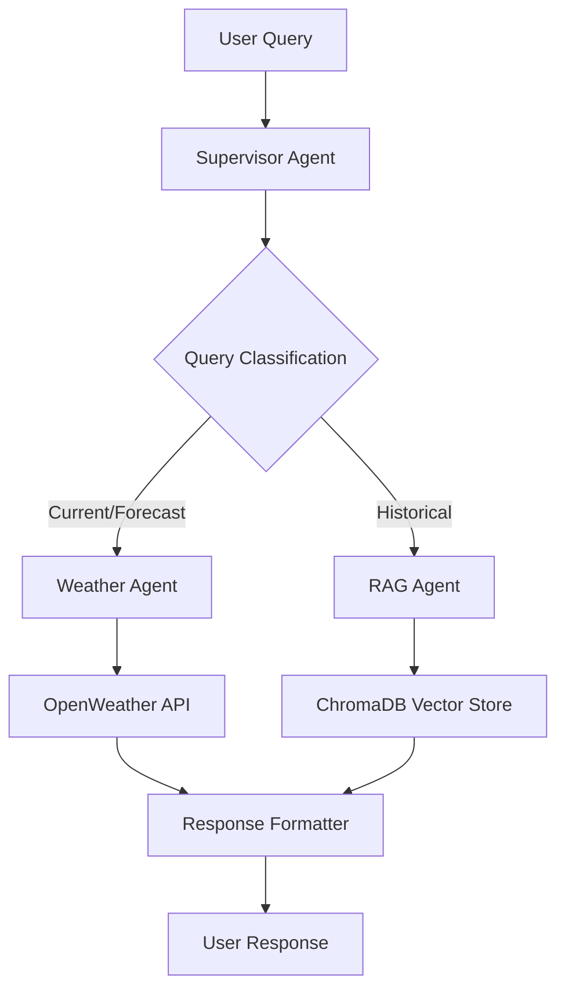

# Weather Multi-Agent Information System

A sophisticated multi-agent system built with LangGraph that intelligently routes and processes weather-related queries using specialized AI agents.

## 🎯 Problem Statement

Create a multi-agent system using LangGraph to answer weather-related queries. The system determines if a query needs:

- **Real-time weather updates** (current conditions)
- **Weather forecasting** (future predictions)
- **Historical data retrieval** (climate trends, past weather)

The system then delivers a comprehensive, summarized response through coordinated AI agents.

## 🏗️ Architecture

### System Components




### Agent Responsibilities

| Agent | Purpose | Tools Used |
| :-- | :-- | :-- |
| **Supervisor Agent** | Routes queries to appropriate specialized agents | Query classification |
| **Weather Agent** | Handles real-time and forecast weather data | OpenWeather API, city extraction, response formatting |
| **RAG Agent** | Retrieves historical weather and climate data | ChromaDB vector search |

### Key Features

- **Intelligent Routing**: Automatically classifies queries as real-time, forecast, or historical
- **Multi-Source Data**: Combines live API data with historical knowledge base
- **Natural Language Processing**: Extracts cities and understands context
- **Memory Persistence**: Maintains conversation context
- **Error Handling**: Robust error handling for API failures and network issues


## 🚀 Quick Start

### Prerequisites

- Python 3.8+
- Google Gemini API key
- OpenWeather API key


### Installation

1. **Clone the repository**
```bash
git clone https://github.com/yourusername/weather-multi-agent-system.git
cd weather-multi-agent-system
```

2. **Install dependencies**
```bash
pip install -r requirements.txt
```

3. **Set up environment variables**
```bash
# Create a .env file or export directly
export GOOGLE_API_KEY="your_gemini_api_key_here"
export OPENWEATHER_API_KEY="your_openweather_api_key_here"
```

4. **Run the system**
```bash
python weather_agent_system.py
```


## 📋 Requirements

### Required Libraries

```txt
langgraph>=0.0.40
langchain-google-genai>=1.0.0
langchain-chroma>=0.1.0
langchain-core>=0.1.0
pydantic>=2.0.0
requests>=2.28.0
chromadb>=0.4.0
```


### API Requirements

1. **Google Gemini API**: For LLM reasoning and embeddings
    - Get your key: [Google AI Studio](https://makersuite.google.com/app/apikey)
2. **OpenWeather API**: For real-time weather data
    - Get your key: [OpenWeather API](https://openweathermap.org/api)

## 🎛️ Configuration

### Environment Variables

| Variable | Description | Required |
| :-- | :-- | :-- |
| `GOOGLE_API_KEY` | Google Gemini API key for LLM operations | Yes |
| `OPENWEATHER_API_KEY` | OpenWeather API key for live weather data | Yes |

### System Settings

- **Vector Store**: ChromaDB with local persistence (`./chroma_db/`)
- **LLM Model**: Gemini-1.5-Flash (configurable)
- **Embeddings**: Gemini embedding model
- **Temperature**: 0 (deterministic responses)


## 💡 Usage Examples

### Interactive Mode

```bash
🌦 Weather Multi-Agent System (type 'exit' to quit)

You: Current weather in Tokyo
Agent: Current weather in Tokyo is 28°C with clear sky. Humidity: 65%

You: Weather forecast for London next week  
Agent: Weather forecast for London shows temperatures ranging from 18-22°C with occasional rain showers expected mid-week.

You: Historical rainfall data for Mumbai
Agent: Mumbai historical climate shows average annual rainfall of 2200mm, primarily during monsoon season (June-September). Recent years show increased variability due to climate change.
```


## 🔧 Advanced Configuration

### Custom Agent Prompts

Modify agent behavior by updating prompts in the code:

```python
# Example: Customize weather agent prompt
weather_agent = create_react_agent(
    model=gemini_model,
    tools=[extract_city_from_query, openweather_fetch, format_weather_response],
    prompt="Your custom prompt here...",
    name="weather_agent"
)
```


### Adding Historical Data

Expand the knowledge base with additional climate data:

```python
# Add new historical weather documents
new_documents = [
    Document(page_content="Your historical weather data here..."),
]
vectorstore.add_documents(new_documents)
vectorstore.persist()
```


## 🧪 Testing

### Run Unit Tests

```bash
python -m pytest tests/ -v
```


### Manual Testing Queries

Test different query types:

```bash
# Real-time weather
"Current weather in New York"
"What's the temperature in Berlin right now?"

# Forecasts  
"Weather forecast for Sydney tomorrow"
"Will it rain in Paris next week?"

# Historical data
"Climate trends in Tokyo over the past decade"
"Historical rainfall patterns in Mumbai"
```


